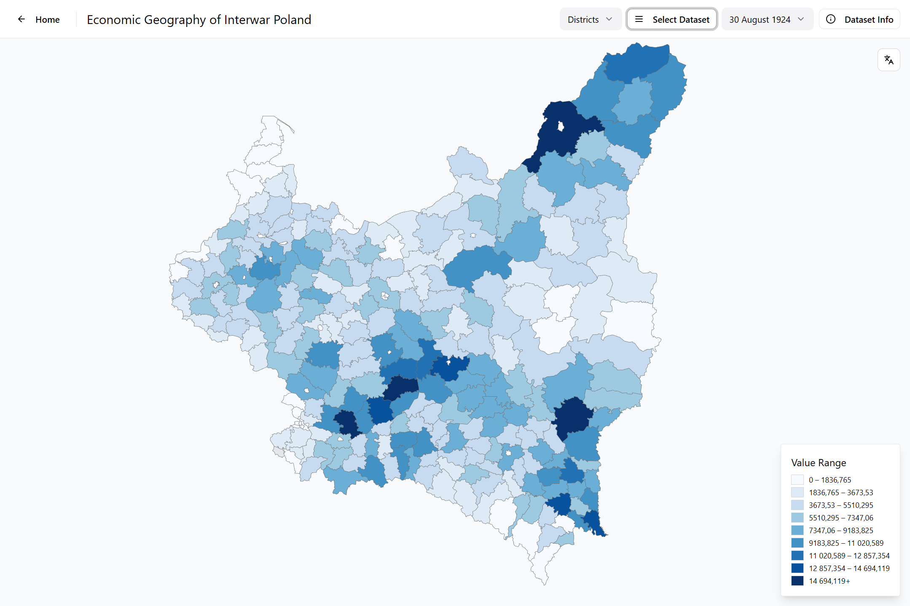

  
   
  <em>View of Barley 1924 crop size per district (quintals).</em>

# interwar_poland_database_website

Visualization of historical district data for Interwar Poland, 1918–1939.

DEMO version. Check out the [live website](https://jjkiljanski.github.io/interwar_poland_database_website/)

## Running the code locally

Run `npm i` to install the dependencies.

Run `npm run dev` to start the development server.
  
